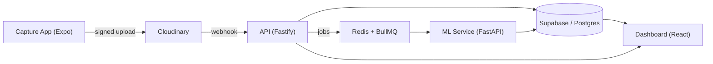
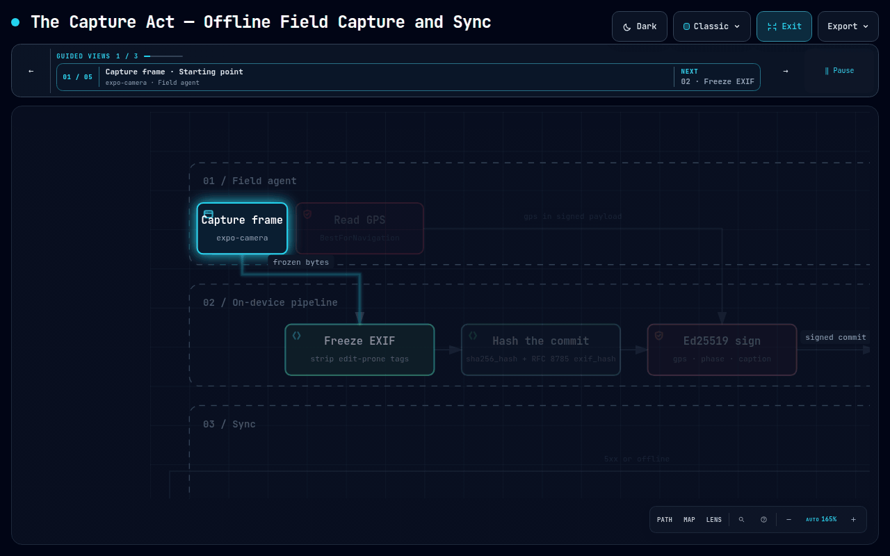
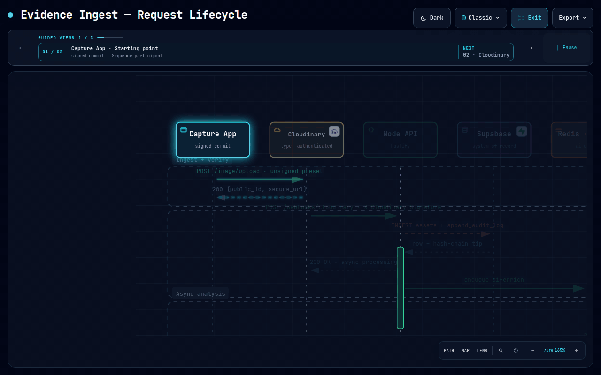
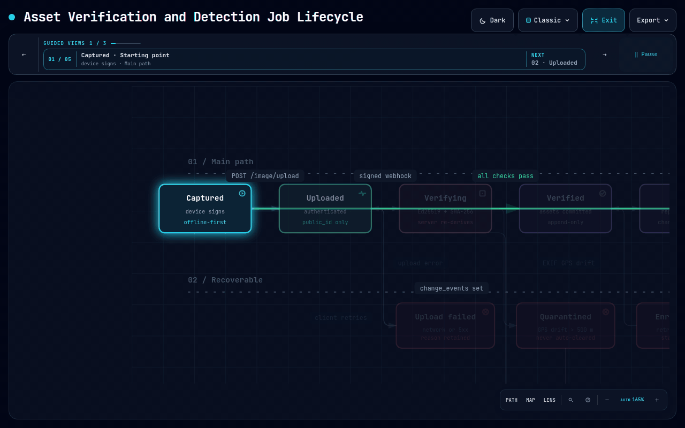

<h1 align="center">Panchnama</h1>

<p align="center"><i>पंचनामा — a written record of inspection, signed by a witness.</i></p>

<p align="center"><b>Turn raw field photos and videos into searchable evidence, quantified impact metrics, and audit-ready reports.</b></p>

<p align="center">
  <a href="LICENSE.txt"></a>
  <a href="https://panchnama-phi.vercel.app"></a>
  
  
  <a href="https://github.com/KA-1205/Panchnama/stargazers"></a>
</p>

<p align="center">
  <a href="#-the-problem">Problem</a> ·
  <a href="#-key-features">Features</a> ·
  <a href="#-how-it-works">How it works</a> ·
  <a href="#-architecture--system-diagrams">Architecture</a> ·
  <a href="#-quick-start">Quick start</a> ·
  <a href="#-project-status">Status</a> ·
  <a href="#-documentation">Docs</a>
</p>

---

> [!NOTE]
> Panchnama is built for **NGOs, governments, and sustainability organisations** that collect huge volumes of field media but cannot organise, verify, or report on it. It is an **evidence and measurement system**, not a DAM or a stock library. Media is stored on Cloudinary, but the product is the proof around it.

## 🔍 The problem

An NGO uploads 40,000 field photos from a six-month reforestation programme. Three months later a donor asks for evidence that 800 hectares were restored. What exists is a phone gallery: nobody can find the northern plots, nobody can prove the "after" photos were taken on the same ground as the "before" photos, and a hand-counted sapling number is impossible to audit.

| Failure | Consequence |
| --- | --- |
| **Media is not evidence.** Edited, re-compressed, or re-captioned with no tamper signal | Every number built on it is disputable; reports get rejected |
| **Impact is unquantified.** "Look, trees!" | Donors fund outcomes, not photographs; counting is manual and unverifiable |
| **Nothing is traceable.** A figure cannot be traced to a photo, model, or version | A report cannot be defended under audit |

Panchnama closes all three: capture is **signed at the moment of the shutter**, change is **measured by a versioned model**, and every report carries a **hash chain** tying a number to a photograph, a model version, and a timestamp.

## ✨ Key features

| Feature | What it does |
| --- | --- |
| **Tamper-proof capture** | Mobile app creates immutable, git-like commits: SHA-256 file hash, Ed25519 device signature (Secure Enclave / Keystore), frozen EXIF, GPS accuracy, and dual timestamps |
| **Multi-sector intelligence** | One project can hold several observation types (e.g. water cleanup, road construction, mangrove planting), each with its own ML model, GPS clustering radius, and metrics schema |
| **AI change detection** | Per-type GPS pairing, then ML routing, then quantified metrics (hectares, counts, % change) plus visual diff overlays |
| **Video support (MVP)** | 30-second clips, auto thumbnails, keyframe extraction, keyframe-based change detection, synchronized diff player |
| **Audit-ready reports** | Template-based PDF/HTML with an integrity appendix (hash chain, signatures, timestamps, GPS accuracy); verification target is under 5 minutes |
| **Full traceability** | SHA-256 hash chain in audit logs, EXIF hash verification, caption signatures, GPS accuracy recording |

<details>
<summary><b>How Panchnama compares to a typical platform</b></summary>

<br>

| Typical platforms | Panchnama |
| --- | --- |
| Upload portal + AI tags | **Tamper-proof capture** + cryptographic proof |
| Manual before/after slider | **Auto GPS clustering** + quantified metrics (hectares, counts) |
| Searchable gallery | **Semantic search** + GPS accuracy and observation-type filters |
| Manual report compilation | **Template-based PDF** + video clips + integrity appendix |
| Trust-based evidence | **Audit-ready**: hash chain, signatures, dual timestamps, EXIF freeze |

</details>

## 🧠 How it works

<p align="center">
  
</p>



1. **Capture:** the field worker picks project, observation type, and phase, then captures a photo or video (30 s max). The app freezes EXIF, records GPS and accuracy, and signs the commit with the device key.
2. **Upload:** straight to Cloudinary with the integrity claims (signature, GPS, caption signature, EXIF hash) in the `context` field.
3. **Ingest and verify:** a Cloudinary webhook hits the API, which independently re-verifies the signature, re-hashes the bytes, and re-canonicalizes EXIF (RFC 8785). The result is `pass`, `fail`, or `unknown`.
4. **AI enrichment:** the API queues an `ai-enrich` job; the ML service runs the sector model, and Cloudinary tagging output is copied into Postgres.
5. **Pairing:** a BullMQ `pair-assets` job runs every 5 minutes, clustering unpaired before/after assets per observation type by GPS radius and time.
6. **Change detection:** the ML service returns quantified metrics and a red-overlay diff image, with the `model_version` recorded. Sectors without a trained model return `unsupported`.
7. **Reports:** Handlebars + Puppeteer produce a self-contained artifact with a `sha256` manifest, so a finalized report renders offline forever.
8. **Delivery:** the dashboard shows change events, a diff slider, a map, and integrity cards. Original media needs a 5-minute auth token.

> [!IMPORTANT]
> Generative AI (Cloudinary remove / fill / recolor / restore) runs **only on derivative report assets**, never on source evidence. Originals keep their SHA-256, EXIF hash, and audit chain intact.

## 📐 Architecture & System Diagrams

The platform's architecture, field capture pipelines, evidence verification, and cryptographic hash chain are fully mapped out below.

<details open>
<summary><b>1. System Topology</b></summary>

<br>

High-level architecture showing client boundaries, Cloudinary media ingestion, API service workers, ML inference routing, and Supabase RLS isolation.


</details>

<details>
<summary><b>2. Field Capture & Offline Sync ("The Capture Act")</b></summary>

<br>

On-device evidence collection pipeline: camera capture, EXIF freezing, SHA-256 commit hashing, Ed25519 hardware key signing (Secure Enclave / Keystore), MMKV local persistence, and background sync retry logic.



</details>

<details>
<summary><b>3. Asset Upload & Ingest Pipeline</b></summary>

<br>

Direct unsigned media upload to Cloudinary with signed `context` payload, Fastify webhook ingestion, signature re-verification, and BullMQ worker job dispatch.


</details>

<details>
<summary><b>4. Evidence Ingest Verification Sequence</b></summary>

<br>

Step-by-step sequence diagram covering direct upload, webhook notification, server-side RFC 8785 EXIF verification, cryptographic validation, and database state updates.



</details>

<details>
<summary><b>5. Evidence Lineage & Cryptographic Hash Chain</b></summary>

<br>

Immutability model tracking raw evidence assets to AI derivatives, audit log SHA-256 chain recalculation, and tamper-detection safeguards.


</details>

<details>
<summary><b>6. Asset Lifecycle States</b></summary>

<br>

State machine detailing transition rules for assets across capture, ingestion, verification (`pass`, `fail`, `unknown`), AI pairing, change detection, and audit report generation.



</details>


## 🚀 Quick start

**Prerequisites**

| Tool | Version |
| --- | --- |
| Node.js | 20.x |
| pnpm | 10.x |
| Python | 3.11 |
| Docker | latest |
| Supabase CLI | 2.x |
| Expo CLI | latest |
| ffmpeg | 8.x |

**1. Clone and install**

```bash
git clone https://github.com/KA-1205/Panchnama.git
cd Panchnama
pnpm install
```

**2. Create local env files**

```bash
for app in api ml-service capture-app dashboard; do
  cp apps/$app/.env.example apps/$app/.env.local
done
# then edit each .env.local with your keys
```

> [!WARNING]
> Required keys include `SUPABASE_URL`, `SUPABASE_ANON_KEY`, `SUPABASE_SERVICE_KEY`, `CLOUDINARY_CLOUD_NAME`, `CLOUDINARY_API_KEY`, `CLOUDINARY_API_SECRET`, and `INTERNAL_JWT_SECRET`. See [docs/operations/deployment.md](docs/operations/deployment.md) for the full list. Never commit secrets or expose them in a client bundle.

**3. Start local infrastructure**

```bash
supabase start       # Postgres, Auth, Realtime, Storage
supabase db reset    # applies all 20 migrations
supabase test db     # optional: pgTAP tests (86 assertions)
```

**4. Run the services**

```bash
pnpm dev             # all services via Turborepo
```

<details>
<summary><b>Run services individually</b></summary>

<br>

```bash
cd apps/api && pnpm dev                                                    # API (Fastify) on :3001
cd apps/ml-service && .venv/bin/uvicorn src.main:app --reload --port 8000  # ML service (FastAPI) on :8000
cd apps/dashboard && pnpm dev                                              # Dashboard (Vite) on :5173
cd apps/capture-app && pnpm start                                          # Capture app (Expo)
```

</details>

<details>
<summary><b>Capture app on a device or emulator</b></summary>

<br>

```bash
cd apps/capture-app
pnpm start             # scan the QR code with Expo Go
pnpm run android       # Android emulator
pnpm run ios           # iOS simulator (macOS only)
eas build --platform all   # EAS build for the stores
```

</details>

> [!TIP]
> Run `bash scripts/check-secrets.sh` before every commit.

### Common commands

| Task | Command |
| --- | --- |
| Run all services | `pnpm dev` |
| Lint / typecheck | `pnpm lint` / `pnpm typecheck` |
| Test (coverage included) | `pnpm test` |
| Build all | `pnpm build` |
| Format | `pnpm format` |
| Docs vs. reality check | `cd apps/api && pnpm run check:docs -- --endpoints-only` |
| Secrets scan | `bash scripts/check-secrets.sh` |

Coverage floors: API 80% branch, ML 70%.

## 🧰 Tech stack

| Layer | Technology | Purpose |
| --- | --- | --- |
| **Capture app** | Expo (React Native), `expo-camera`, `react-native-keychain` | Tamper-proof capture, Ed25519 keys in Secure Enclave |
| **Media core** | Cloudinary | Upload, transformations, AI tagging, video keyframes |
| **Database** | Supabase (PostgreSQL + PostGIS + RLS) | Assets, audit logs, realtime, auth |
| **API** | Node.js 20, Fastify, TypeScript, BullMQ | REST, webhooks, verification, workers |
| **ML service** | Python 3.11, FastAPI, PyTorch, YOLOv8 | Sector-specific change detection, video keyframes |
| **Dashboard** | React 19, Vite, TanStack Query, MapLibre GL | Search, reports, map, integrity viewer |


## 📁 Project structure

```text
Panchnama/
├── apps/
│   ├── api/              # Node 20 · Fastify · TypeScript · BullMQ
│   ├── ml-service/       # Python 3.11 · FastAPI · PyTorch · YOLOv8
│   ├── capture-app/      # Expo · React Native · expo-camera
│   └── dashboard/        # React 19 · Vite · TanStack Query · MapLibre
├── packages/
│   ├── shared/           # Types, Zod schemas, RFC 8785, signing
│   └── ui-components/    # Shared React components
├── docs/                 # Architecture, planning, operations
├── scripts/              # Helper scripts (e.g. check-secrets.sh)
├── supabase/migrations/  # 20 numbered migrations
├── docs/internal/AGENTS.md   # Rules and conventions
└── turbo.json            # Turborepo pipeline
```

## ⚙️ Configuration and ML routing

Each project defines its **observation types**. Each type picks an ML model, a GPS clustering radius, and a phase field.

<details>
<summary><b>Example <code>projects.config</code></b></summary>

<br>

```json
{
  "name": "Restoration of Nature",
  "sector": "mixed",
  "config": {
    "observation_types": [
      { "type": "ganga_cleanup",     "label": "Ganga Cleanup",     "model": "water",          "gps_radius": 10, "phase_field": "cleanup_phase" },
      { "type": "road_construction", "label": "Road Construction", "model": "infrastructure", "gps_radius": 5,  "phase_field": "build_phase" },
      { "type": "mangrove_planting", "label": "Mangrove Planting", "model": "forestry",       "gps_radius": 5,  "phase_field": "planting_phase" }
    ],
    "report_template": "integrated_restoration_report",
    "gps_cluster_radius_default": 5
  }
}
```

Projects can nest through `parent_project_id` (recursive CTE for tree queries). Sub-projects separate teams, permissions, and reports; observation types separate activities and models.

</details>

> [!NOTE]
> Models resolve from the `model_registry` table. A sector with no trained model returns `unsupported` and is **never** served by another sector's model, because a wrong-sector number in a donor report is a credibility failure.

| Model key | Current status |
| --- | --- |
| `forestry` | Registered as `trained`, but a **placeholder: no weights exist yet** |
| `water` | `unsupported` |
| `infrastructure` | `unsupported` |
| `agriculture` | `unsupported` |

## 🔐 Security and integrity

| Threat | Mitigation |
| --- | --- |
| EXIF edited before upload | Frozen at capture, hash verified server-side |
| GPS spoofed | Accuracy and provider recorded, dual timestamps |
| Caption added after capture | Signed at capture with the device Ed25519 key |
| File swapped | Content-addressable storage (SHA-256) |
| Backdated capture | Device and server timestamps both recorded |
| App tampering | Code signing (Expo EAS) + hardware-backed keys |

- **Immutable hash chain:** `current_hash = SHA256(previous_hash + action + actor + timestamp)` in `audit_logs`.
- **Verification:** `verify_asset_integrity(asset_id)` returns five checks (EXIF hash, SHA-256 match, caption signature, sync delay, audit chain), each `pass`, `fail`, or `unknown`.
- **Clock skew:** without a signed NTP offset the check returns `unknown`, never `pass`.
- **Compliance:** org-scoped Row Level Security on all tables, data minimisation, deletion via `upload_status = 'deleted'`.

<details>
<summary><b>API endpoints</b></summary>

<br>

| Area | Method and endpoint | Description |
| --- | --- | --- |
| Assets | `GET /api/projects/:id/assets` | List with filters: `bbox`, `date_from`, `date_to`, `tags`, `gps_accuracy_max`, `observation_type`, `phase` |
| Assets | `GET /api/assets/:id/integrity` | Timestamps, GPS accuracy, signature checks |
| Assets | `GET /api/assets/:id/audit-trail` | Hash chain and transformation history |
| Projects | `GET /api/projects`, `GET /api/projects/:id`, `POST /api/projects` | List, detail with config, create |
| Change events | `GET /api/projects/:id/change-events`, `GET /api/change-events/:id` | Before/after pairs with metrics and diff URL |
| Reports | `POST /api/reports/generate` | Returns `pdf_url`, `html_url`, `social_assets[]` |
| Reports | `GET /api/report-templates?sector=forestry` | Templates by sector |
| Search | `GET /api/search` | `q`, `bbox`, `date_from`, `date_to`, `tags`, `gps_accuracy_max`, `asset_type` |
| Webhooks | `POST /webhooks/cloudinary` | Upload notification, verification, storage |

Full contracts: [docs/architecture/api-contracts.md](docs/architecture/api-contracts.md).

</details>

<details>
<summary><b>ML service endpoints</b></summary>

<br>

| Endpoint | Purpose |
| --- | --- |
| `POST /detect-change` | Before/after image change detection with metrics and diff image |
| `POST /detect-change-video` | Keyframe-based change detection for video |
| `POST /classify-activity` | Activity type and phase classification |
| `POST /extract-signals` | Vegetation index, water presence, machinery, canopy cover, etc. |

</details>

## 📊 Project status

Panchnama core platform is fully implemented across all four services:

- **Capture App (Expo / React Native)**: Hardware-backed Ed25519 signing (Secure Enclave / Keystore), EXIF freezing, offline MMKV commit queue, direct Cloudinary uploads.
- **API Service (Fastify / Node 20)**: Cloudinary webhook verification, RFC 8785 EXIF re-canonicalization, BullMQ background queues, audit-ready PDF/HTML report generation.
- **ML Intelligence Service (FastAPI / PyTorch)**: Sector-specific computer vision models (YOLOv8 + ChangeFormer), keyframe extraction, visual diff overlays.
- **Dashboard (React 19 / Vite)**: MapLibre GL spatial search, before/after diff player, integrity timeline viewer, Supabase RLS data access.

For full acceptance criteria and validation matrix, see [docs/architecture/MVP_EXIT_CRITERIA.md](docs/architecture/MVP_EXIT_CRITERIA.md).

## 📚 Documentation

| Document | Description |
| --- | --- |
| [ARCHITECTURE.md](docs/architecture/ARCHITECTURE.md) | Component topology, security boundaries, and decision log |
| [PRD.md](docs/planning/PRD.md) | Product requirements and acceptance criteria |
| [BUILD_ORDER.md](docs/planning/BUILD_ORDER.md) | Phased execution plan and module gates |
| [DATABASE_SCHEMA.md](docs/architecture/DATABASE_SCHEMA.md) | PostgreSQL table DDL, RLS policies, and integrity functions |
| [API Contracts](docs/architecture/api-contracts.md) | Fastify REST endpoints and ML service interfaces |
| [Cloudinary Transformations](docs/architecture/CLOUDINARY_TRANSFORMATIONS.md) | Verified Cloudinary parameters for media pipelines |
| [Frontend Architecture](docs/architecture/FRONTEND_ARCHITECTURE.md) | Capture app and dashboard module layout |
| [Demo Walkthrough](docs/operations/demo.md) | Live demo execution script and verification steps |
| [Deployment Guide](docs/operations/deployment.md) | Production setup and deployment procedures |


## ❓ FAQ

<details>
<summary><b>Does the capture app work offline?</b></summary>

<br>

Yes. Commits are stored in encrypted MMKV locally and queued for upload. Background sync via `expo-background-fetch` resumes when connectivity returns.

</details>

<details>
<summary><b>What if GPS accuracy is poor?</b></summary>

<br>

The threshold is configurable (default 10 m). The app shows live accuracy and disables the capture button above the threshold. Accuracy is stored with each asset for downstream filtering.

</details>

<details>
<summary><b>What if the ML model is wrong?</b></summary>

<br>

Every detection returns a confidence score. Low-confidence events are flagged for human review, the dashboard shows confidence badges, and manual override is possible.

</details>

<details>
<summary><b>What if Cloudinary goes down?</b></summary>

<br>

The capture app queues locally, and Supabase, Redis, and the API run independently. Cloudinary is only needed for upload, transformation, and delivery, not for auth or data integrity.

</details>

<details>
<summary><b>Can we add a new sector later?</b></summary>

<br>

Yes. Add a new `SectorModel` class, register it in `SECTOR_MODELS`, and add a project config with the new `observation_type`. No platform code changes are needed.

</details>

## 🤝 Contributing

1. Read [AGENTS.md](docs/internal/AGENTS.md) for conventions and the definition of done.
2. Make sure `pnpm lint`, `pnpm typecheck`, and `pnpm test` pass.
3. Run `bash scripts/check-secrets.sh` before committing.
4. Open a pull request; one teammate approval is required.

## 📄 License

This project is licensed under the MIT License. See [LICENSE.txt](LICENSE.txt) for details.

---

<p align="center">
  If Panchnama is useful to you, consider giving it a ⭐
</p>